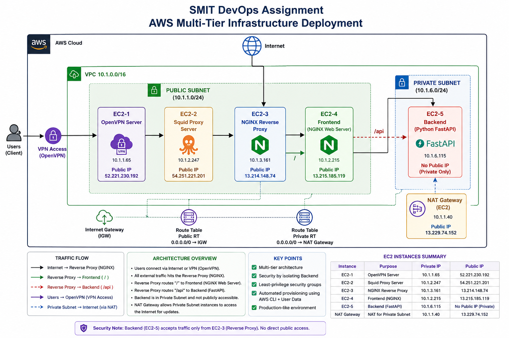
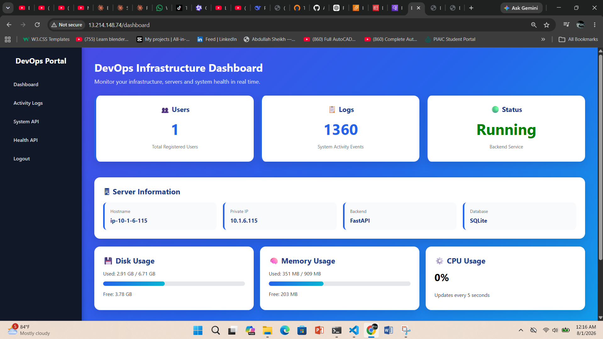
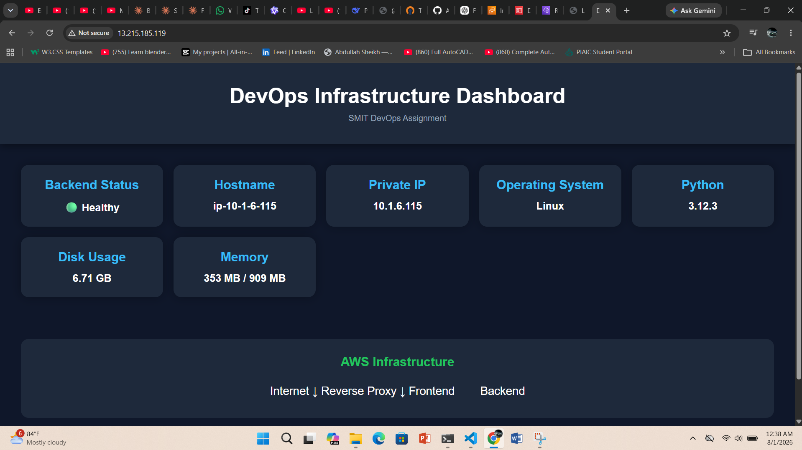
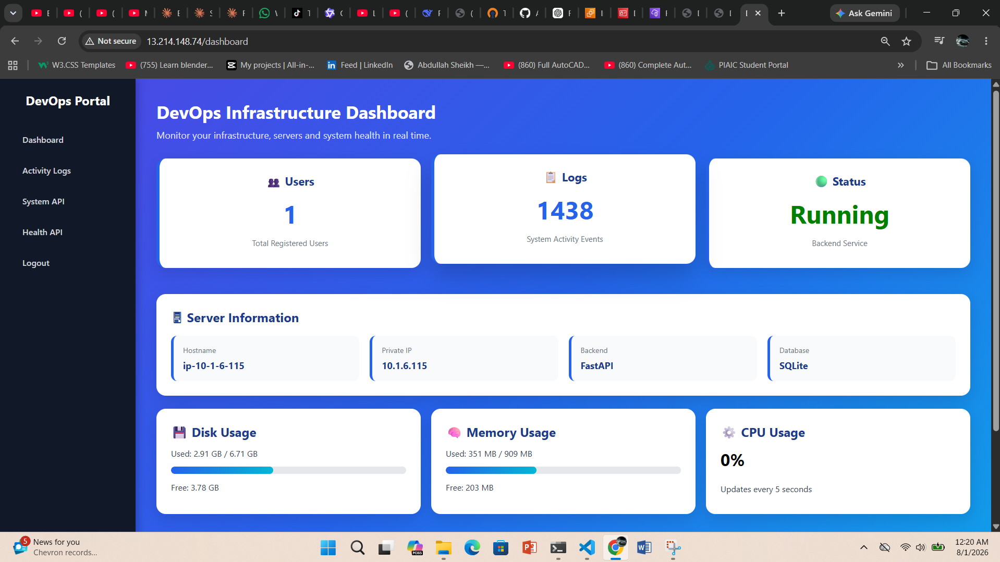
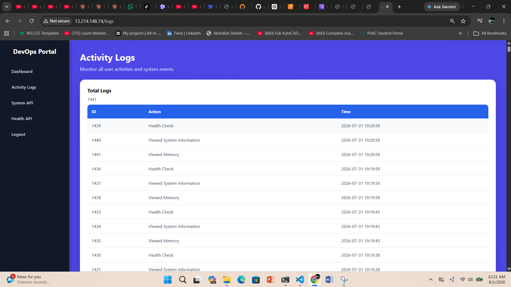
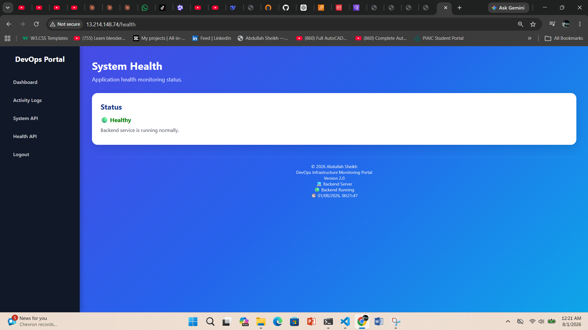
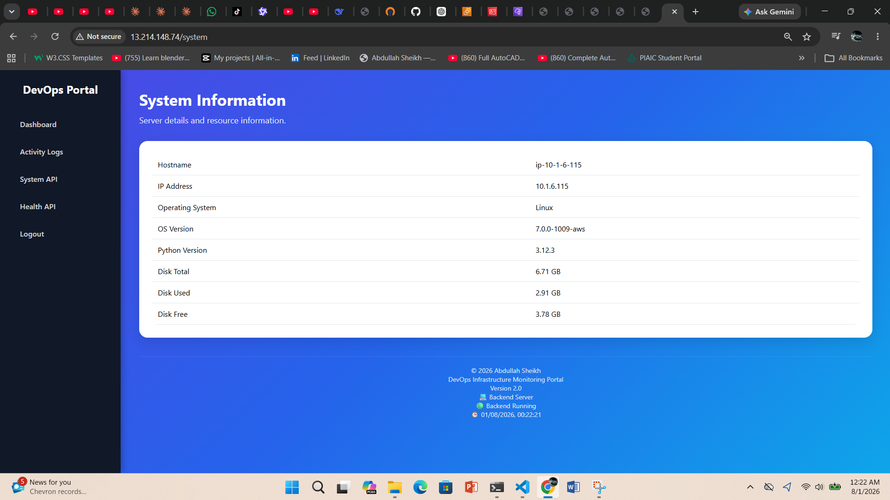
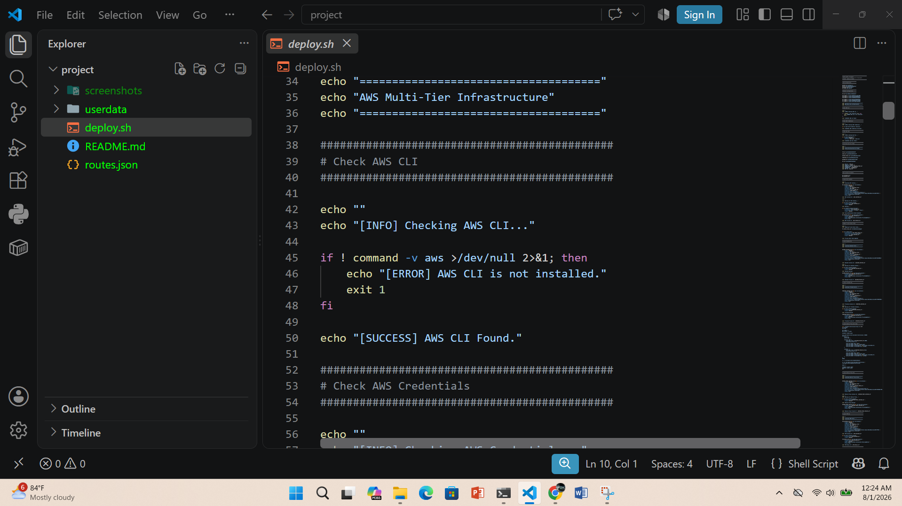
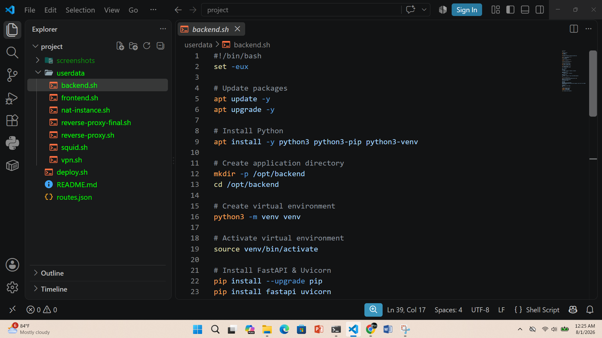
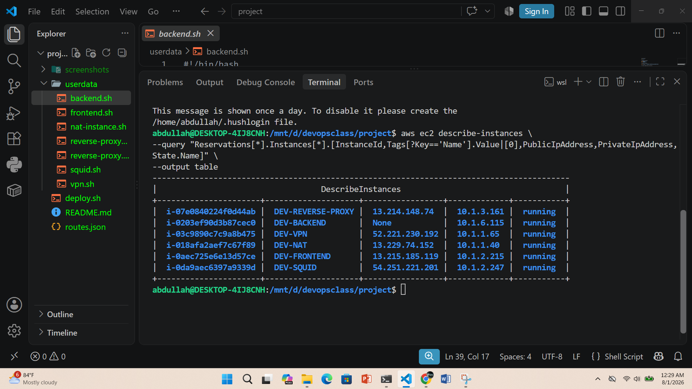

#  SMIT DevOps Assignment

## AWS Multi-Tier Infrastructure Deployment with Nginx Reverse Proxy & FastAPI Backend



## 📌 Project Overview

This project demonstrates a production-style DevOps infrastructure deployment on AWS.

The architecture is designed using multiple EC2 instances with public and private subnet separation. A Reverse Proxy layer using Nginx handles incoming traffic and routes requests between the Frontend and Backend services.

The Backend application is developed using FastAPI and deployed inside a private subnet, while the Frontend is served using Nginx.

---

# 🏗️ Architecture Overview

```
                         Internet
                            |
                            |
                            v
              +---------------------------+
              | Reverse Proxy EC2         |
              | Nginx                     |
              | Public IP: 13.214.148.74  |
              | Private IP: 10.1.3.161    |
              +---------------------------+
                            |
              -------------------------------
              |                             |
              v                             v

+-----------------------+       +-----------------------+
| Frontend EC2          |       | Backend EC2            |
| Nginx                 |       | FastAPI                |
| Public IP:             |       | Private Subnet         |
| 13.215.185.119        |       | 10.1.6.115             |
+-----------------------+       +-----------------------+

```

---

# ☁️ AWS Infrastructure

## VPC

| Component | Value                      |
| --------- | -------------------------- |
| VPC CIDR  | 10.1.0.0/16                |
| Region    | ap-southeast-1 (Singapore) |

---

# 🖥️ EC2 Instances

| Instance          | Purpose             | Public IP      | Private IP |
| ----------------- | ------------------- | -------------- | ---------- |
| DEV-VPN           | OpenVPN Server      | 52.221.230.192 | 10.1.1.65  |
| DEV-NAT           | NAT Gateway Server  | 13.229.74.152  | 10.1.1.40  |
| DEV-SQUID         | Proxy Server        | 54.251.221.201 | 10.1.2.247 |
| DEV-REVERSE-PROXY | Nginx Reverse Proxy | 13.214.148.74  | 10.1.3.161 |
| DEV-FRONTEND      | Nginx Frontend      | 13.215.185.119 | 10.1.2.215 |
| DEV-BACKEND       | FastAPI Backend     | Private Only   | 10.1.6.115 |

---

# 🛠️ Technologies Used

## Cloud

* AWS EC2
* AWS VPC
* Security Groups
* Subnets
* Route Tables
* Internet Gateway
* NAT Gateway

## Backend

* Python
* FastAPI
* Uvicorn
* Jinja2 Templates

## Frontend

* HTML
* CSS
* JavaScript
* Nginx

## DevOps Tools

* AWS CLI
* Bash Automation
* Linux Ubuntu
* Git & GitHub

---

# ⚙️ Deployment Flow

The complete infrastructure is deployed using automation scripts.

Deployment structure:

```
project/

├── deploy.sh

├── userdata/
│
├── vpn.sh
├── squid.sh
├── reverse-proxy.sh
├── frontend.sh
└── backend.sh


├── README.md

└── screenshots/
```

---

#  Deployment Steps

## 1. Configure AWS CLI

```bash
aws configure
```

Configure:

* AWS Access Key
* AWS Secret Key
* Default Region

Example:

```bash
ap-southeast-1
```

---

## 2. Run Deployment Script

```bash
chmod +x deploy.sh

./deploy.sh
```

The script automatically:

* Creates EC2 instances
* Configures networking
* Applies User Data scripts
* Installs required packages
* Deploys services

---

# 🔄 Application Flow

```
User Browser

      |
      v

Nginx Reverse Proxy

      |
      |
      +------------+
      |            |
      v            v

Frontend        Backend API

Nginx           FastAPI

```

---

# 📊 Monitoring Dashboard

The project includes a DevOps Monitoring Dashboard showing:

✅ Backend Health Status
✅ Hostname
✅ Private IP
✅ Operating System
✅ Python Version
✅ Disk Usage
✅ Memory Usage

---

# 🌐 Application URLs

## Reverse Proxy Dashboard

```
http://13.214.148.74/
```

## Frontend Server

```
http://13.215.185.119/
```

---

# 📸 Screenshots

## Reverse Proxy Dashboard



## Frontend Page



## Backend Dashboard



## Activity Logs



## Health Page



## System Information



## Deployment Script



## Userdata Folder



## AWS CLI Deployment Output



## Architecture Diagram


---

# 🔐 Security Design

Security improvements implemented:

* Backend deployed in private subnet
* Only Reverse Proxy exposes application traffic
* Security Groups restrict access
* Separate public and private networking layers
* Nginx reverse proxy protects backend service

---

# ✅ Project Status

Deployment Status:

```
Frontend        ✅ Running
Reverse Proxy   ✅ Running
Backend API     ✅ Running
Networking      ✅ Configured
Monitoring      ✅ Working
```

---

# 👨‍💻 Author

**Abdullah Sheikh**

SMIT DevOps Assignment

```
AWS + Linux + Nginx + FastAPI + Automation
```
